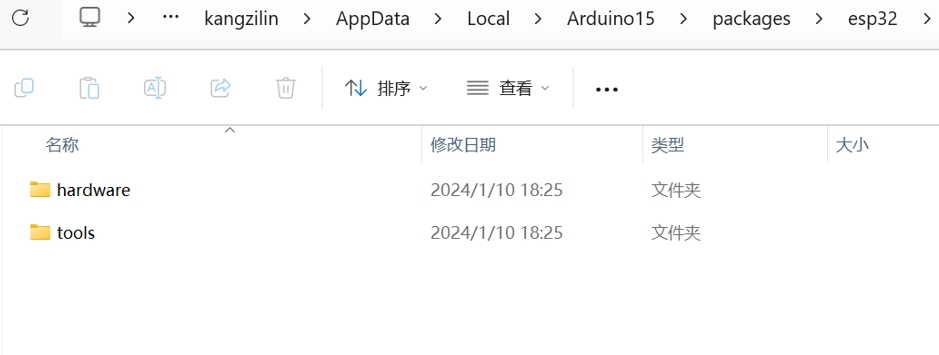
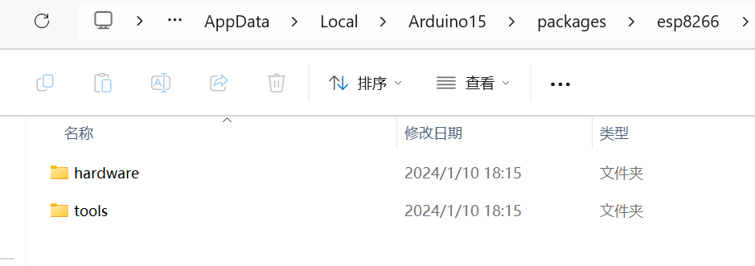
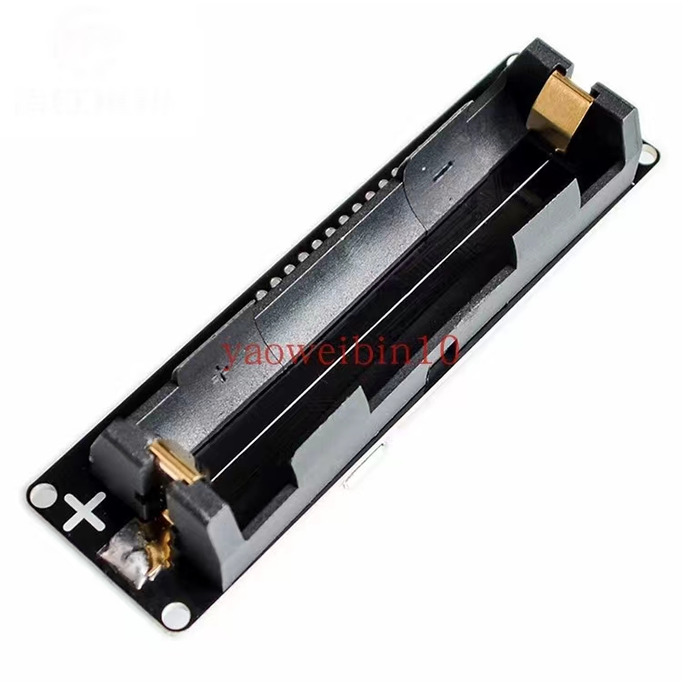
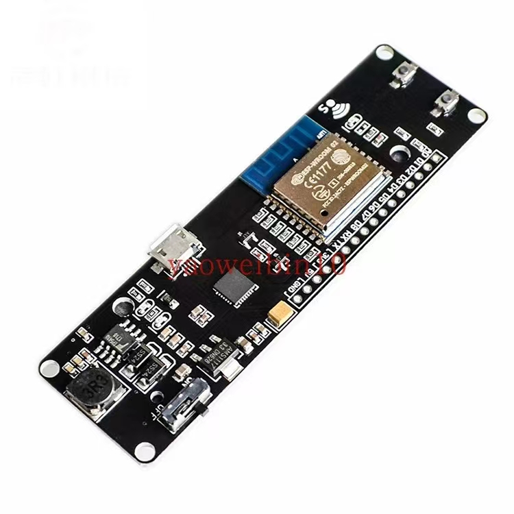
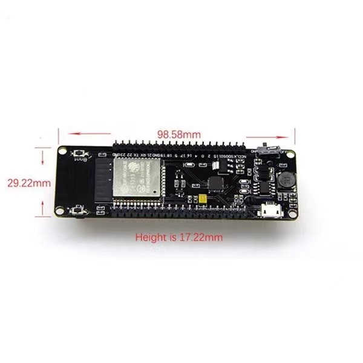
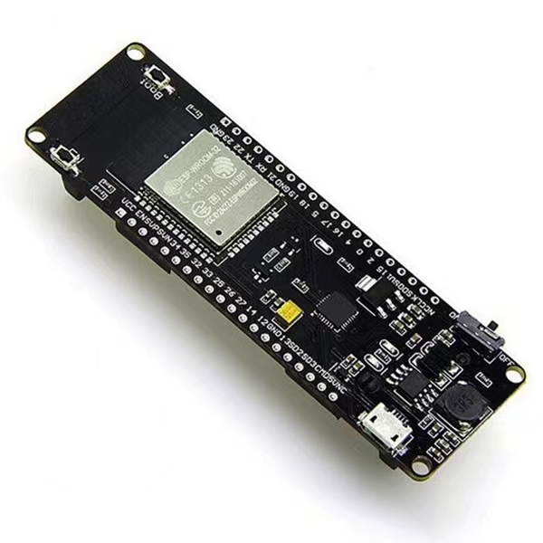

# arduino IDE

> 用手机提供热点,然后安装

文件管理器地址栏输入 %LOCALAPPDATA%/Arduino15/packages

## wems esp-wroom-02主板,迷你WIFI模块 ESP8266+18650电池套介绍

本开发板集成ESP8266 18650电池一个标准的 3000mah 18650电池可运行17小时。

可以称之为“WiFi电池”。我要做更容易开发ESP8266 ESP8266项目增加18650的电池。

当你做一些ESP8266项目你一定痛恨添加电源提供动力。这个微型板可以解决这样的问题。 3000mah 18650电池可以使ESP8266运行17小时或更多。

是什么让它特别？

· 兼容nodemcu。

· 18650充电系统集成。

· 指示LED（绿色表示充满红色意味着·充电）可以边充电边使用。

· 开关控制电源。

· SMT连接器可用于睡眠模式· 1额外的LED可编程（gpio16 ）

· 0.5a充电电流

· 1A输出

· 过充电保护

· 过放电保护

· 10数字引脚的读/写/中断/ PWM / I2C /线支持（除了D0）

· 模拟输入要小心+-。

如果电池方向错误，充电芯片将被损毁。

## WiFi和蓝牙电池座18500 esp32开发板学习板评估板工控板

当你做一些esp32projects你一定痛恨添加电源提供动力。这块小木板能解决这样的问题。LG 3000mah 18650电池可以使esp32run 17小时以上。

18650充电系统集成。

指示LED内（绿色意味着全部和红色意味着充电）

充电和工作可以同时进行。

1开关可控制电源。

1个额外的LED可编程（gpio16）

0.5a充电电流

1A的输出

过充电保护

过放电保护

全esp32引脚突围

点击链接了解更多详情：

http://espressif.com/en/products/hardware/esp32-devkitc/overview

